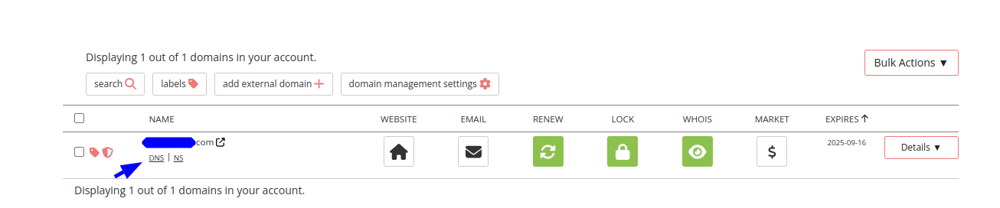
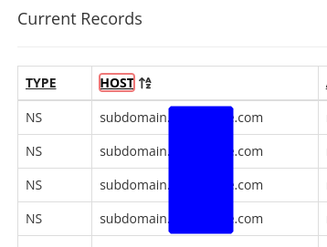

# Porkbun Subdomains as AWS Route 53 Hosted Zones using Terraform

## Add subdomain 

1. Follow the
   Porkbun [getting started](https://kb.porkbun.com/article/190-getting-started-with-the-porkbun-api) to use the API
   to activate the API for your domain and get the API key and Secret key.
2. Ensure that you have permissions to create hosted zones in AWS.
3. Create the SSM Parameters:

```bash
aws ssm put-parameter \
    --name "/porkbun/api_key" \
    --value "<PORKBUN_API_KEY>" \
    --type "SecureString" \
    --description "Porkbun API key" 

aws ssm put-parameter \
    --name "/porkbun/secret_api_key" \
    --value "<PORKBUN_SECRET_API_KEY>" \
    --type "SecureString" \
    --description "Porkbun Secret key"
```

4. Write your terraform.tfvars:

```bash
mv template.terraform.tfvars terraform.tfstate
```

And complete it with your values

5. `terraform init`
6. `terraform apply`
7. Check that you have correctly set the NS values in Porkbun:
   
   
8. After ~10 you should be able to check it from your terminal using `dig`:

```bash
dig subdomain.domain.com NS
```

If everything is ok you should see the four NS records from the hosted zone.

Now you can use your hosted zone to redirect a Load Balancer or and instance as you would normally do.

